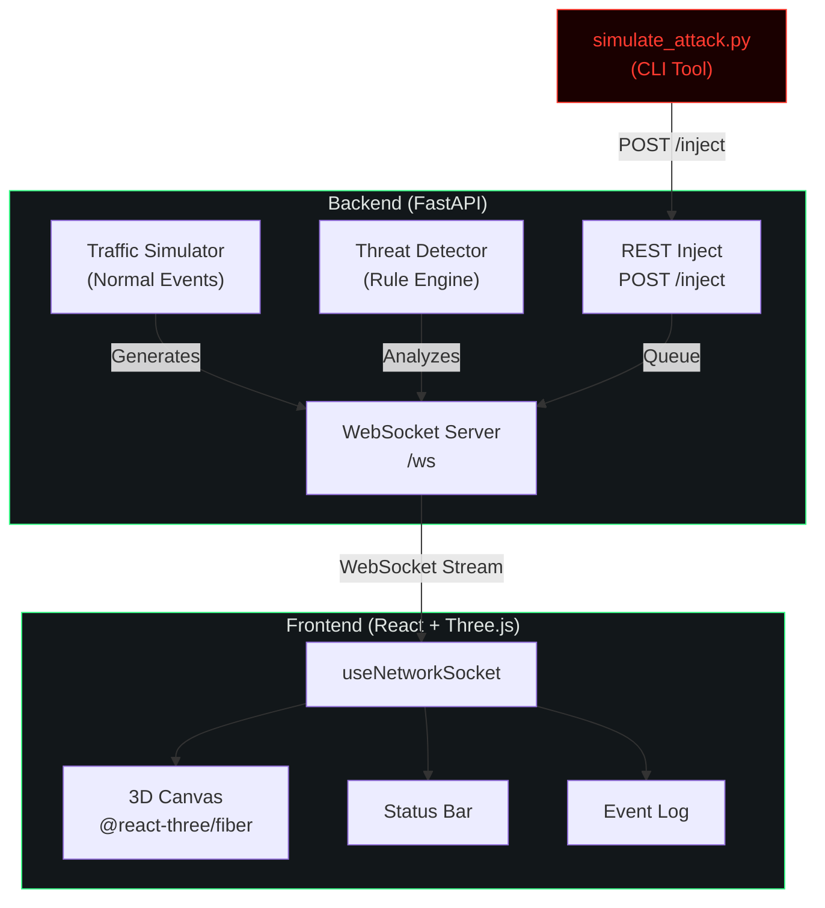

<p align="center">
  
</p>

<h1 align="center">NetSentinel</h1>

<p align="center">
  <strong>Real-time network threat visualization</strong><br/>
  A live animated 3D dashboard that captures network traffic, detects suspicious patterns,<br/>
  and renders them as an interactive node graph with real-time threat alerts.
</p>

<p align="center">
  
  
  
  
</p>

---

## What is NetSentinel?

NetSentinel is an open-source network security visualization tool that:

- **Visualizes** your network as a live 3D node graph — each device is a floating node, each connection an animated beam of light
- **Detects** threats in real-time using a simple, explainable rule-based engine (port scans, brute-force login attempts, anomalous data transfers)
- **Alerts** with dramatic visual feedback — attacking nodes flare red with expanding shockwave rings, connection lines turn red, and the event log fills with color-coded threat entries

Built for hackathon demos and security training — fully self-contained with simulated traffic, no real packet capture needed to run.

---

## Architecture



### Detection Rules

| Threat Type | Rule | Threshold | Window |
|---|---|---|---|
| **Port Scan** | Connections to N distinct ports from same source | ≥10 ports | 5 seconds |
| **Brute Force** | Failed auth attempts from same source | ≥5 attempts | 10 seconds |
| **Data Exfiltration** | Single outbound transfer exceeding threshold | ≥50 MB | Instant |

All rules are explainable — no black-box ML. Judges can understand the detection logic in seconds.

---

## Quick Start

### Option 1: Docker (Recommended)

```bash
git clone https://github.com/yourusername/netsentinel.git
cd netsentinel
docker-compose up --build
```

Open [http://localhost:5173](http://localhost:5173) in your browser.

### Option 2: Manual Setup

**Backend:**
```bash
cd backend
python -m venv venv
source venv/bin/activate    # Windows: venv\Scripts\activate
pip install -r requirements.txt
uvicorn app.main:app --host 0.0.0.0 --port 8000
```

**Frontend (new terminal):**
```bash
cd frontend
npm install
npm run dev
```

Open [http://localhost:5173](http://localhost:5173).

---

## How to Demo This

This is the demo flow for a live presentation:

### 1. Start the Stack
```bash
# Terminal 1 — Backend
cd backend
uvicorn app.main:app --port 8000

# Terminal 2 — Frontend
cd frontend
npm run dev
```

### 2. Show the Calm State
Open the dashboard. You'll see:
- 12 network nodes floating in 3D space with gentle idle motion
- Green connection lines with animated data packets traveling between nodes
- A quiet event log streaming normal heartbeats, connections, and data transfers
- Status bar showing `NODES: 12 | THREATS: 0`

Let this run for 10–15 seconds. This is the "everything is normal" baseline.

### 3. Launch the Attack
In a third terminal:

```bash
cd backend
python simulate_attack.py                     # Port scan (default)
python simulate_attack.py --type brute_force  # Brute force variant
python simulate_attack.py --type both         # Both sequentially
```

### 4. Watch the Dashboard React
Within 1–2 seconds:
- ⚡ A new node appears on the edge of the graph — the attacker (`10.0.0.66`)
- 🔴 The attacker node flares red with a shockwave ring expanding outward
- 📡 The connection line to the target (`web-srv-01`) turns red and thickens
- 📋 3–4 red log entries stream into the event panel in quick succession
- 📊 The threat counter in the status bar increments

This moment is the demo's centerpiece.

---

## Tech Stack

| Layer | Technology |
|---|---|
| **3D Visualization** | React, Three.js, @react-three/fiber, @react-three/drei |
| **UI Chrome** | Tailwind CSS v4, custom CSS design system |
| **Realtime** | Native WebSocket |
| **Backend** | Python 3.11+, FastAPI, Uvicorn |
| **Packet Capture** | Scapy (optional, for real traffic mode) |
| **Packaging** | Docker, docker-compose |

---

## Project Structure

```
netsentinel/
├── backend/
│   ├── app/
│   │   ├── __init__.py
│   │   ├── main.py          # FastAPI server + WebSocket endpoint
│   │   ├── detector.py      # Rule-based threat detection engine
│   │   └── simulator.py     # Normal traffic generator + device pool
│   ├── simulate_attack.py   # CLI attack injection tool
│   ├── requirements.txt
│   └── Dockerfile
├── frontend/
│   ├── src/
│   │   ├── scene/           # 3D components (NetworkGraph, Node, etc.)
│   │   ├── components/      # UI (StatusBar, EventLog, ScanlineOverlay)
│   │   ├── hooks/           # State management (useNetworkSocket, useUptime)
│   │   ├── App.jsx          # Root layout
│   │   ├── main.jsx         # Entry point
│   │   └── index.css        # Design system + global styles
│   ├── index.html
│   ├── vite.config.js
│   ├── package.json
│   └── Dockerfile
├── docker-compose.yml
├── README.md
├── LICENSE
└── .gitignore
```

---

## Screenshots

> Screenshots will be added after the first demo run.

---

## Contributing

1. Fork the repository
2. Create your feature branch (`git checkout -b feature/amazing-feature`)
3. Commit your changes (`git commit -m 'Add amazing feature'`)
4. Push to the branch (`git push origin feature/amazing-feature`)
5. Open a Pull Request

---

## License

This project is licensed under the MIT License — see the [LICENSE](LICENSE) file for details.
